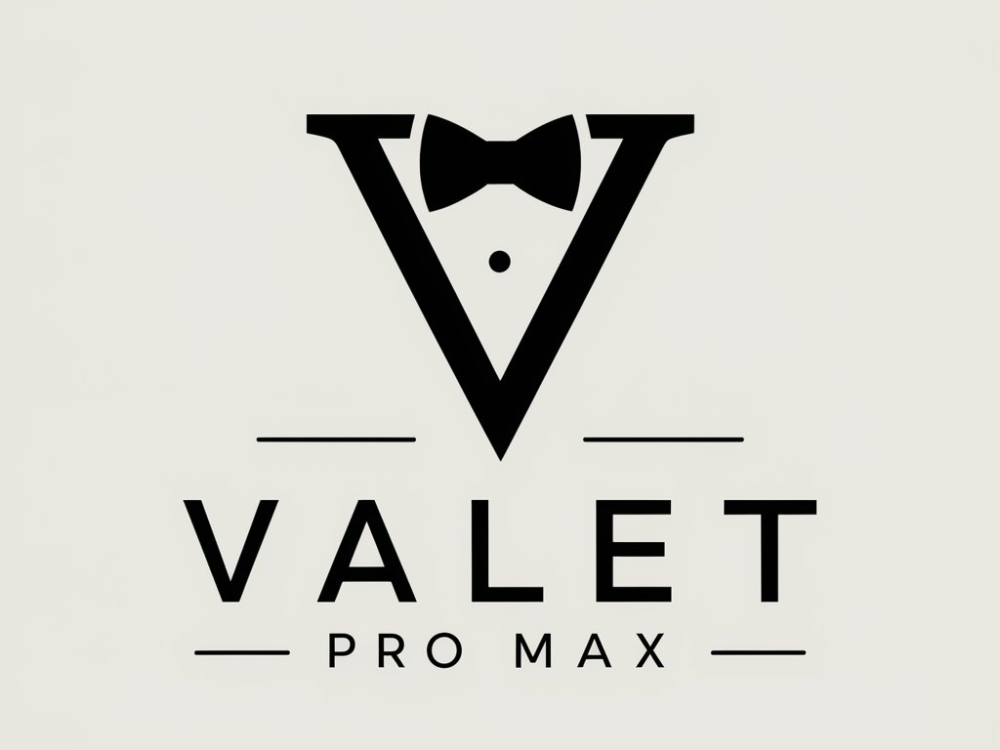

## Introduction

Valet Pro Max is a development environment for macOS. No Vagrant, no Docker, no `/etc/hosts` file.

Go here for the [Valet PRO MAX documentation](https://github.com/nntoan/valet-pro-max/wiki).

### Installing

For installing Valet Pro Max follow the installation notes as describe in [INSTALL.MD](INSTALL.MD).

## Credits

This project is a fork of [weprovide/valet-plus](https://github.com/weprovide/valet-plus). Thanks to all of the contributors, especially the original authors and contributors:

- Tim Neutkens ([@timneutkens](https://github.com/timneutkens))
- Sam Granger ([@samgranger](https://github.com/samgranger))
- Lou van der Laarse ([@Neodork](https://github.com/Neodork))
- Sander Pott (@Sander Valet+ slack channel)
- Mischa Braam ([@mischabraam](https://github.com/mischabraam))

## Valet Pro Max Contributors

- Toan Nguyen ([@nntoan](https://github.com/nntoan))

## Get in touch

We have a slack workspace available [which you can join](https://join.slack.com/t/valet-plus/shared_invite/enQtNDE2MjU2NzgyNjQwLWFiYWNjOWFhOWQ2ZDcyOTEyZTA2MzAzOWYyYzYwMTYzODVlMGE3ZDg3ZWQ1M2JmN2M0OGY3OGUwMDI3NDM1NDU).

Yes, we have a Valet Pro Max fan page https://www.nntoan.com/valet-pro-max
